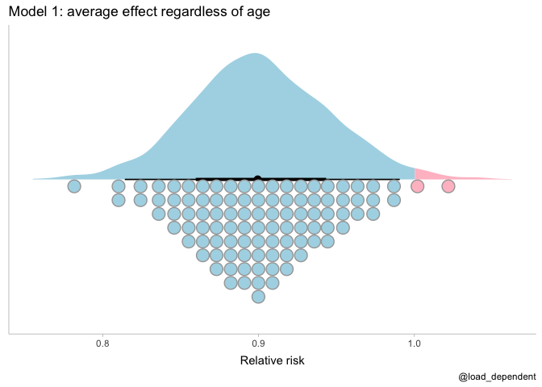
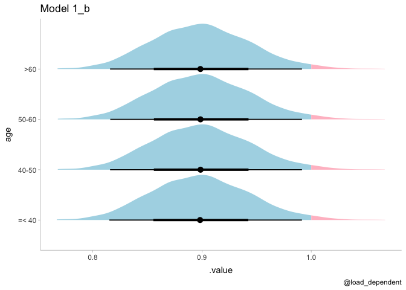
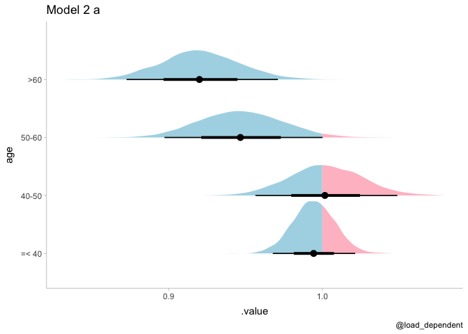

Interaction analysis
================
Lars Mølgaard Saxhaug

``` r
df <- tribble(
 ~age,      ~n,     ~intervention_prevalence_ratio , ~control_prevalence,
 "=< 40",  147954,   0.977,                            0.0055,
 "40-50",  36002,    1.003,                            0.0095,
 "50-60",  24282,    0.768,                            0.0108,
 ">60",    28102,    0.669,                            0.0103   # n reduced to from 28103 for simplicity
   
) %>% 
  mutate(control_n=n/2,
         intervention_n=n/2,
         control_events=round(control_n*control_prevalence),
         intervention_events=round(intervention_n*control_prevalence*intervention_prevalence_ratio)) %>% 
  select(age,starts_with(c("control","intervention")),-contains(c("ratio","prevalence"))) %>% 
  pivot_longer(cols = starts_with(c("control","intervention")),names_to=c("group","variable"),names_sep = "_") %>% 
  pivot_wider(names_from = "variable",values_from = "value") %>% 
  mutate(across(age,~ordered(.x,levels=c("=< 40","40-50","50-60",">60"))),across(group,as.factor)) %>% 
  mutate(age_unord=factor(age,ordered = FALSE))
```

Frequentist test for interaction

``` r
fmod1 <- glm(cbind(events,n-events)~group,family = binomial,data = df)
summary(fmod1)
```

    ## 
    ## Call:
    ## glm(formula = cbind(events, n - events) ~ group, family = binomial, 
    ##     data = df)
    ## 
    ## Deviance Residuals: 
    ##     Min       1Q   Median       3Q      Max  
    ## -5.7836  -0.5333   2.9124   4.1291   4.7674  
    ## 
    ## Coefficients:
    ##                   Estimate Std. Error  z value Pr(>|z|)    
    ## (Intercept)       -4.92270    0.03434 -143.337   <2e-16 ***
    ## groupintervention -0.10687    0.04990   -2.142   0.0322 *  
    ## ---
    ## Signif. codes:  0 '***' 0.001 '**' 0.01 '*' 0.05 '.' 0.1 ' ' 1
    ## 
    ## (Dispersion parameter for binomial family taken to be 1)
    ## 
    ##     Null deviance: 129.05  on 7  degrees of freedom
    ## Residual deviance: 124.46  on 6  degrees of freedom
    ## AIC: 184.43
    ## 
    ## Number of Fisher Scoring iterations: 4

``` r
fmod2 <- glm(cbind(events,n-events)~group+group:factor(age,ordered = FALSE),family = binomial,data = df)
summary(fmod2)
```

    ## 
    ## Call:
    ## glm(formula = cbind(events, n - events) ~ group + group:factor(age, 
    ##     ordered = FALSE), family = binomial, data = df)
    ## 
    ## Deviance Residuals: 
    ## [1]  0  0  0  0  0  0  0  0
    ## 
    ## Coefficients:
    ##                                                     Estimate Std. Error
    ## (Intercept)                                         -5.19718    0.04971
    ## groupintervention                                   -0.02248    0.07069
    ## groupcontrol:factor(age, ordered = FALSE)40-50       0.55021    0.09151
    ## groupintervention:factor(age, ordered = FALSE)40-50  0.57858    0.09163
    ## groupcontrol:factor(age, ordered = FALSE)50-60       0.67888    0.10093
    ## groupintervention:factor(age, ordered = FALSE)50-60  0.43879    0.11185
    ## groupcontrol:factor(age, ordered = FALSE)>60         0.63384    0.09715
    ## groupintervention:factor(age, ordered = FALSE)>60    0.25085    0.11361
    ##                                                      z value Pr(>|z|)    
    ## (Intercept)                                         -104.560  < 2e-16 ***
    ## groupintervention                                     -0.318   0.7504    
    ## groupcontrol:factor(age, ordered = FALSE)40-50         6.012 1.83e-09 ***
    ## groupintervention:factor(age, ordered = FALSE)40-50    6.314 2.72e-10 ***
    ## groupcontrol:factor(age, ordered = FALSE)50-60         6.726 1.74e-11 ***
    ## groupintervention:factor(age, ordered = FALSE)50-60    3.923 8.74e-05 ***
    ## groupcontrol:factor(age, ordered = FALSE)>60           6.524 6.85e-11 ***
    ## groupintervention:factor(age, ordered = FALSE)>60      2.208   0.0272 *  
    ## ---
    ## Signif. codes:  0 '***' 0.001 '**' 0.01 '*' 0.05 '.' 0.1 ' ' 1
    ## 
    ## (Dispersion parameter for binomial family taken to be 1)
    ## 
    ##     Null deviance:  1.2905e+02  on 7  degrees of freedom
    ## Residual deviance: -4.3698e-12  on 0  degrees of freedom
    ## AIC: 71.971
    ## 
    ## Number of Fisher Scoring iterations: 3

``` r
anova(fmod1,fmod2,test = "LRT")
```

    ## Analysis of Deviance Table
    ## 
    ## Model 1: cbind(events, n - events) ~ group
    ## Model 2: cbind(events, n - events) ~ group + group:factor(age, ordered = FALSE)
    ##   Resid. Df Resid. Dev Df Deviance  Pr(>Chi)    
    ## 1         6     124.46                          
    ## 2         0       0.00  6   124.46 < 2.2e-16 ***
    ## ---
    ## Signif. codes:  0 '***' 0.001 '**' 0.01 '*' 0.05 '.' 0.1 ' ' 1

Model 1: simple for overall effect without interaction with age Model
1\_b: added age specific intercept Model 2: Interaction with categorical
age Model 3: Interaction with age as monotonic effect Model 3\_b: Prior
ruling out negatie effect

``` r
# simple model for overall effect
mod1 <- brm(events|trials(n)~group,family = binomial,data = df,file = here("fits","mod1.rds"),file_refit = "on_change",save_pars = save_pars(all = TRUE))
mod1
```

    ##  Family: binomial 
    ##   Links: mu = logit 
    ## Formula: events | trials(n) ~ group 
    ##    Data: df (Number of observations: 8) 
    ## Samples: 4 chains, each with iter = 2000; warmup = 1000; thin = 1;
    ##          total post-warmup samples = 4000
    ## 
    ## Population-Level Effects: 
    ##                   Estimate Est.Error l-95% CI u-95% CI Rhat Bulk_ESS Tail_ESS
    ## Intercept            -4.92      0.03    -4.99    -4.86 1.00     3982     3031
    ## groupintervention    -0.11      0.05    -0.21    -0.01 1.00     3838     2631
    ## 
    ## Samples were drawn using sampling(NUTS). For each parameter, Bulk_ESS
    ## and Tail_ESS are effective sample size measures, and Rhat is the potential
    ## scale reduction factor on split chains (at convergence, Rhat = 1).

``` r
plot(mod1)
```

<!-- -->

``` r
# added age specific intercept
mod1_b <- brm(events|trials(n)~group+age,family = binomial,data = df,file = here("fits","mod1_b.rds"),file_refit = "on_change",save_pars = save_pars(all = TRUE))
mod1_b
```

    ##  Family: binomial 
    ##   Links: mu = logit 
    ## Formula: events | trials(n) ~ group + age 
    ##    Data: df (Number of observations: 8) 
    ## Samples: 4 chains, each with iter = 2000; warmup = 1000; thin = 1;
    ##          total post-warmup samples = 4000
    ## 
    ## Population-Level Effects: 
    ##                   Estimate Est.Error l-95% CI u-95% CI Rhat Bulk_ESS Tail_ESS
    ## Intercept            -4.76      0.04    -4.83    -4.69 1.00     5155     3357
    ## groupintervention    -0.11      0.05    -0.20    -0.01 1.00     5144     2920
    ## age.L                 0.31      0.05     0.20     0.41 1.00     3894     2944
    ## age.Q                -0.33      0.06    -0.44    -0.22 1.00     4585     3161
    ## age.C                 0.10      0.06    -0.01     0.22 1.00     4861     3135
    ## 
    ## Samples were drawn using sampling(NUTS). For each parameter, Bulk_ESS
    ## and Tail_ESS are effective sample size measures, and Rhat is the potential
    ## scale reduction factor on split chains (at convergence, Rhat = 1).

``` r
plot(mod1_b)
```

<!-- -->

``` r
# model with added interaction with categorical age
mod2 <- brm(events|trials(n)~group*age,family = binomial,data = df,file = here("fits","mod2.rds"),file_refit = "on_change",save_pars = save_pars(all = TRUE))
mod2
```

    ##  Family: binomial 
    ##   Links: mu = logit 
    ## Formula: events | trials(n) ~ group * age 
    ##    Data: df (Number of observations: 8) 
    ## Samples: 4 chains, each with iter = 2000; warmup = 1000; thin = 1;
    ##          total post-warmup samples = 4000
    ## 
    ## Population-Level Effects: 
    ##                         Estimate Est.Error l-95% CI u-95% CI Rhat Bulk_ESS
    ## Intercept                  -4.73      0.04    -4.81    -4.66 1.00     3879
    ## groupintervention          -0.17      0.06    -0.28    -0.06 1.00     4044
    ## age.L                       0.45      0.07     0.32     0.59 1.00     2803
    ## age.Q                      -0.30      0.08    -0.44    -0.15 1.00     3161
    ## age.C                       0.06      0.08    -0.10     0.21 1.00     2806
    ## groupintervention:age.L    -0.32      0.11    -0.53    -0.11 1.00     2828
    ## groupintervention:age.Q    -0.09      0.11    -0.31     0.13 1.00     2990
    ## groupintervention:age.C     0.09      0.12    -0.15     0.33 1.00     2556
    ##                         Tail_ESS
    ## Intercept                   3242
    ## groupintervention           2893
    ## age.L                       2396
    ## age.Q                       2770
    ## age.C                       2746
    ## groupintervention:age.L     3012
    ## groupintervention:age.Q     3009
    ## groupintervention:age.C     2856
    ## 
    ## Samples were drawn using sampling(NUTS). For each parameter, Bulk_ESS
    ## and Tail_ESS are effective sample size measures, and Rhat is the potential
    ## scale reduction factor on split chains (at convergence, Rhat = 1).

``` r
plot(mod2)
```

<!-- --><!-- -->

``` r
# model with added interaction with age as monotonic effect
mod3 <- brm(events|trials(n)~group*mo(age),family = binomial,data = df,file = here("fits","mod3.rds"),file_refit = "on_change",save_pars = save_pars(all = TRUE))
mod3
```

    ##  Family: binomial 
    ##   Links: mu = logit 
    ## Formula: events | trials(n) ~ group * mo(age) 
    ##    Data: df (Number of observations: 8) 
    ## Samples: 4 chains, each with iter = 2000; warmup = 1000; thin = 1;
    ##          total post-warmup samples = 4000
    ## 
    ## Population-Level Effects: 
    ##                         Estimate Est.Error l-95% CI u-95% CI Rhat Bulk_ESS
    ## Intercept                  -5.21      0.05    -5.30    -5.12 1.00     2821
    ## groupintervention           0.01      0.06    -0.11     0.13 1.00     2563
    ## moage                       0.23      0.03     0.18     0.28 1.00     2254
    ## moage:groupintervention    -0.14      0.04    -0.23    -0.06 1.00     2256
    ##                         Tail_ESS
    ## Intercept                   2698
    ## groupintervention           2559
    ## moage                       2651
    ## moage:groupintervention     2811
    ## 
    ## Simplex Parameters: 
    ##                             Estimate Est.Error l-95% CI u-95% CI Rhat Bulk_ESS
    ## moage1[1]                       0.82      0.09     0.63     0.96 1.00     2880
    ## moage1[2]                       0.11      0.08     0.00     0.28 1.00     3108
    ## moage1[3]                       0.08      0.06     0.00     0.22 1.00     3688
    ## moage:groupintervention1[1]     0.16      0.13     0.00     0.48 1.00     3033
    ## moage:groupintervention1[2]     0.39      0.22     0.04     0.84 1.00     3995
    ## moage:groupintervention1[3]     0.46      0.22     0.05     0.85 1.00     3720
    ##                             Tail_ESS
    ## moage1[1]                       2186
    ## moage1[2]                       2465
    ## moage1[3]                       2329
    ## moage:groupintervention1[1]     1709
    ## moage:groupintervention1[2]     2607
    ## moage:groupintervention1[3]     2475
    ## 
    ## Samples were drawn using sampling(NUTS). For each parameter, Bulk_ESS
    ## and Tail_ESS are effective sample size measures, and Rhat is the potential
    ## scale reduction factor on split chains (at convergence, Rhat = 1).

``` r
plot(mod3)
```

<!-- -->

``` r
# as model 3 but with prior ruling out negative effect
mod3_b <- brm(events|trials(n)~group*mo(age),family = binomial,data = df,file = here("fits","mod3_b.rds"),file_refit = "on_change",save_pars = save_pars(all = TRUE),
              prior = prior(normal(0,1),class="b",ub=0))
mod3_b
```

    ##  Family: binomial 
    ##   Links: mu = logit 
    ## Formula: events | trials(n) ~ group * mo(age) 
    ##    Data: df (Number of observations: 8) 
    ## Samples: 4 chains, each with iter = 2000; warmup = 1000; thin = 1;
    ##          total post-warmup samples = 4000
    ## 
    ## Population-Level Effects: 
    ##                         Estimate Est.Error l-95% CI u-95% CI Rhat Bulk_ESS
    ## Intercept                  -4.92      0.03    -4.99    -4.85 1.00     3954
    ## groupintervention          -0.10      0.05    -0.20    -0.02 1.00     2740
    ## moage                      -0.00      0.00    -0.01    -0.00 1.00     2491
    ## moage:groupintervention    -0.01      0.01    -0.04    -0.00 1.00     2796
    ##                         Tail_ESS
    ## Intercept                   2959
    ## groupintervention           1103
    ## moage                       2002
    ## moage:groupintervention     1655
    ## 
    ## Simplex Parameters: 
    ##                             Estimate Est.Error l-95% CI u-95% CI Rhat Bulk_ESS
    ## moage1[1]                       0.28      0.22     0.01     0.79 1.00     3542
    ## moage1[2]                       0.32      0.23     0.01     0.83 1.00     3552
    ## moage1[3]                       0.40      0.25     0.01     0.90 1.00     3464
    ## moage:groupintervention1[1]     0.25      0.22     0.01     0.79 1.00     3641
    ## moage:groupintervention1[2]     0.33      0.24     0.01     0.86 1.00     4019
    ## moage:groupintervention1[3]     0.41      0.26     0.02     0.91 1.00     3503
    ##                             Tail_ESS
    ## moage1[1]                       2196
    ## moage1[2]                       2366
    ## moage1[3]                       2682
    ## moage:groupintervention1[1]     2191
    ## moage:groupintervention1[2]     2170
    ## moage:groupintervention1[3]     2882
    ## 
    ## Samples were drawn using sampling(NUTS). For each parameter, Bulk_ESS
    ## and Tail_ESS are effective sample size measures, and Rhat is the potential
    ## scale reduction factor on split chains (at convergence, Rhat = 1).

``` r
plot(mod3_b)
```

<!-- -->

``` r
mod1 <- mod1 %>% add_criterion("loo", moment_match=TRUE,reloo=TRUE)
mod1_b <- mod1_b %>% add_criterion("loo", moment_match=TRUE,reloo=TRUE)
```

    ## Warning: Some Pareto k diagnostic values are slightly high. See help('pareto-k-diagnostic') for details.

    ## No problematic observations found. Returning the original 'loo' object.

    ## Automatically saving the model object in '/Users/larsmolg/Dropbox/NTNU/Miniprojects/mask_interaction_sim/fits/mod1_b.rds'

``` r
mod2 <- mod2 %>% add_criterion("loo", moment_match=TRUE,reloo=TRUE)
mod3 <- mod3 %>% add_criterion("loo", moment_match=TRUE,reloo=TRUE)
mod3_b <- mod3_b %>% add_criterion("loo", moment_match=TRUE,reloo=TRUE)
l <- loo_compare(mod1,mod1_b,mod2,mod3)

cbind(loo_diff = l[, 1] * -2,
      se       = l[, 2] *  2)
```

    ##         loo_diff        se
    ## mod3     0.00000  0.000000
    ## mod1_b  15.95308  4.556248
    ## mod2    41.08355 20.060144
    ## mod1   192.98013 69.228080

``` r
model_weights(mod1,mod1_b,mod2,mod3,weights = "loo")
```

    ##         mod1       mod1_b         mod2         mod3 
    ## 1.243796e-42 3.433071e-04 1.198592e-09 9.996567e-01

``` r
df %>% 
  modelr::data_grid(age,group,n=1) %>% 
  add_linpred_draws(mod2,scale="linear") %>% 
  compare_levels(.value,by = group) %>%
  #compare_levels(.value,by=age,comparison="pairwise") %>% 
  mutate(or=exp(.value)) %>% 
  median_hdi(or)
```

    ## # A tibble: 4 x 9
    ## # Groups:   age, group [4]
    ##   age   group                      n    or .lower .upper .width .point .interval
    ##   <ord> <chr>                  <dbl> <dbl>  <dbl>  <dbl>  <dbl> <chr>  <chr>    
    ## 1 =< 40 intervention - control     1 0.978  0.847  1.12    0.95 median hdi      
    ## 2 40-50 intervention - control     1 1.00   0.802  1.23    0.95 median hdi      
    ## 3 50-60 intervention - control     1 0.768  0.591  0.986   0.95 median hdi      
    ## 4 >60   intervention - control     1 0.664  0.497  0.847   0.95 median hdi

``` r
df %>% 
  modelr::data_grid(age,group,n=1) %>% 
  add_linpred_draws(mod3_b,scale="linear") %>% 
  compare_levels(.value,by = group) %>%
  compare_levels(.value,by=age,comparison="pairwise") %>% 
  mutate(or=exp(.value)) %>% 
  median_hdi(or)
```

    ## # A tibble: 6 x 9
    ## # Groups:   age, group [6]
    ##   age         group                n    or .lower .upper .width .point .interval
    ##   <chr>       <chr>            <dbl> <dbl>  <dbl>  <dbl>  <dbl> <chr>  <chr>    
    ## 1 >60 - =< 40 intervention - …     1 0.980  0.910   1.00   0.95 median hdi      
    ## 2 >60 - 40-50 intervention - …     1 0.986  0.920   1.00   0.95 median hdi      
    ## 3 >60 - 50-60 intervention - …     1 0.994  0.939   1.00   0.95 median hdi      
    ## 4 40-50 - =<… intervention - …     1 0.997  0.980   1.00   0.95 median hdi      
    ## 5 50-60 - =<… intervention - …     1 0.990  0.954   1.00   0.95 median hdi      
    ## 6 50-60 - 40… intervention - …     1 0.995  0.965   1.00   0.95 median hdi

``` r
df %>% 
  modelr::data_grid(group,n=1) %>% 
  add_linpred_draws(mod1,scale="linear") %>% 
  compare_levels(.value,by = group) %>%
  mutate(or=exp(.value)) %>% 
  ggplot(aes(x=or,fill=after_stat(ifelse(x>1,"over","under"))))+
  stat_halfeye()+
  scale_fill_manual(values=c("pink","lightblue"))+
  theme_tidybayes()+
  theme(legend.position = "none")+
  labs(title = "Model 1",
       caption = "@load_dependent")
```

<!-- -->

``` r
df %>% 
  modelr::data_grid(group,age,n=1) %>% 
  add_linpred_draws(mod1,scale="linear") %>% 
  compare_levels(.value,by = group) %>%
  mutate(or=exp(.value)) %>% 
  ggplot(aes(x=or,y=age,fill=after_stat(ifelse(x>1,"over","under"))))+
  stat_halfeye()+
  scale_fill_manual(values=c("pink","lightblue"))+
  theme_tidybayes()+
  theme(legend.position = "none")+
  labs(title = "Model 1_b",
       caption = "@load_dependent")
```

<!-- -->

``` r
df %>% 
  modelr::data_grid(age,group,n=1) %>% 
  add_linpred_draws(mod2,scale="linear") %>% 
  compare_levels(.value,by = group) %>%
  #compare_levels(.value,by=age,comparison="pairwise") %>% 
  mutate(or=exp(.value)) %>% 
  ggplot(aes(x=or,y=age,fill=after_stat(ifelse(x>1,"over","under"))))+
  stat_halfeye()+
  scale_fill_manual(values=c("pink","lightblue"))+
  theme_tidybayes()+
  theme(legend.position = "none")+
  labs(title = "Model 2",
       caption = "@load_dependent")
```

<!-- -->

``` r
df %>% 
  modelr::data_grid(age,group,n=1) %>% 
  add_linpred_draws(mod3,scale="linear") %>% 
  compare_levels(.value,by = group) %>%
  mutate(or=exp(.value)) %>% 
  compare_levels(.value,by=age,comparison="pairwise") %>% 
  ggplot(aes(x=.value,y=age,fill=after_stat(ifelse(x>0,"over","under"))))+
  stat_halfeye()+
  scale_fill_manual(values=c("pink","lightblue"))+
  theme_tidybayes()+
  theme(legend.position = "none")+
  labs(title = "Model 3",
       caption = "@load_dependent")
```

<!-- -->

``` r
df %>% 
  modelr::data_grid(age,group,n=1) %>% 
  add_linpred_draws(mod3_b,scale="linear") %>% 
  compare_levels(.value,by = group) %>%
  mutate(or=exp(.value)) %>% 
  #compare_levels(.value,by=age,comparison="pairwise") %>% 
  ggplot(aes(x=.value,y=age,fill=after_stat(ifelse(x>1,"over","under"))))+
  stat_halfeye()+
  scale_fill_manual(values=c("pink","lightblue"))+
  theme_tidybayes()+
  theme(legend.position = "none")+
  labs(title = "Model 3_b (prior ruling out neg effect)",
       caption = "@load_dependent")
```

<!-- -->
