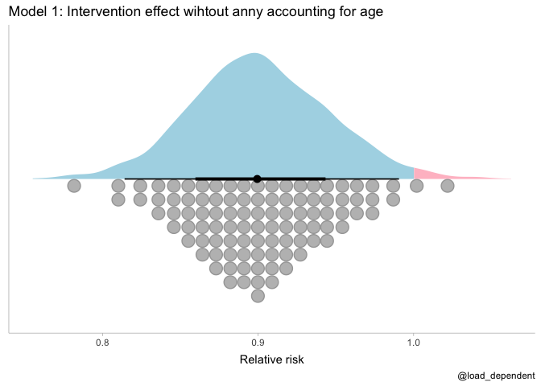
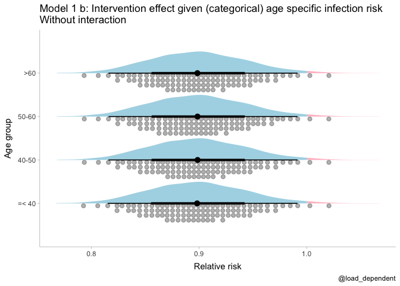
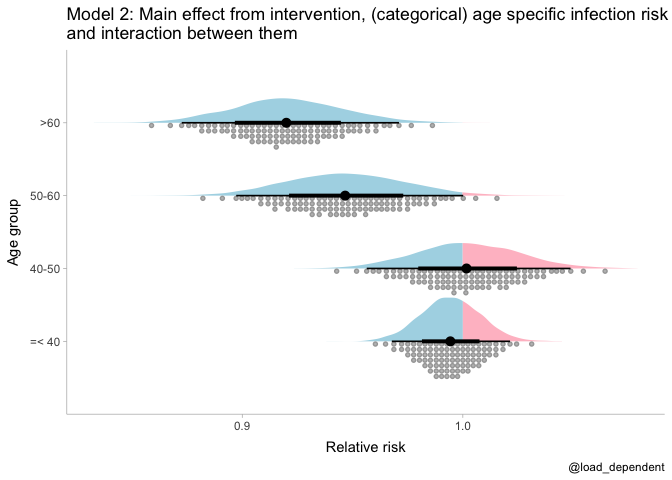
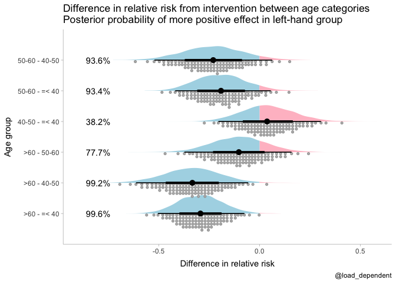
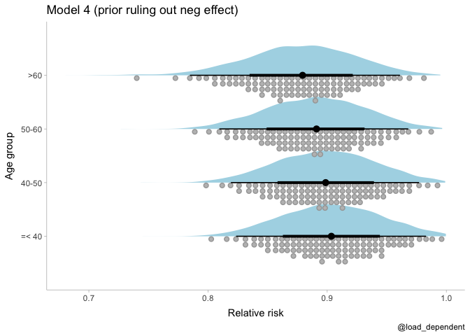

Interaction analysis
================
Lars Mølgaard Saxhaug

Disclaimer: This is NOT a proper reanalysis (only loosely based on
[this](https://www.poverty-action.org/publication/impact-community-masking-covid-19-cluster-randomized-trial-bangladesh)
trial), but a proof of concept of analysis of interaction using bayesian
methods.

``` r
df <- tribble(
 ~age,      ~n,     ~intervention_prevalence_ratio , ~control_prevalence,
 "=< 40",  147954,   0.977,                            0.0055,
 "40-50",  36002,    1.003,                            0.0095,
 "50-60",  24282,    0.768,                            0.0108,
 ">60",    28102,    0.669,                            0.0103   # n reduced to from 28103 for simplicity
   
) %>% 
  mutate(control_n=n/2,
         intervention_n=n/2,
         control_events=round(control_n*control_prevalence),
         intervention_events=round(intervention_n*control_prevalence*intervention_prevalence_ratio)) %>% 
  select(age,starts_with(c("control","intervention")),-contains(c("ratio","prevalence"))) %>% 
  pivot_longer(cols = starts_with(c("control","intervention")),names_to=c("group","variable"),names_sep = "_") %>% 
  pivot_wider(names_from = "variable",values_from = "value") %>% 
  mutate(across(age,~ordered(.x,levels=c("=< 40","40-50","50-60",">60"))),across(group,as.factor)) 
```

Frequentist test of interaction

``` r
# treatment effect only
freq_mod <- glm(cbind(events,n-events)~group*age,family = binomial,data = df)
summary(freq_mod)
```

    ## 
    ## Call:
    ## glm(formula = cbind(events, n - events) ~ group * age, family = binomial, 
    ##     data = df)
    ## 
    ## Deviance Residuals: 
    ## [1]  0  0  0  0  0  0  0  0
    ## 
    ## Coefficients:
    ##                            Estimate Std. Error  z value Pr(>|z|)    
    ## (Intercept)                -5.19718    0.04971 -104.560  < 2e-16 ***
    ## groupintervention          -0.02248    0.07069   -0.318   0.7504    
    ## age40-50                    0.55021    0.09151    6.012 1.83e-09 ***
    ## age50-60                    0.67888    0.10093    6.726 1.74e-11 ***
    ## age>60                      0.63384    0.09715    6.524 6.85e-11 ***
    ## groupintervention:age40-50  0.02837    0.12950    0.219   0.8266    
    ## groupintervention:age50-60 -0.24009    0.15066   -1.594   0.1110    
    ## groupintervention:age>60   -0.38299    0.14949   -2.562   0.0104 *  
    ## ---
    ## Signif. codes:  0 '***' 0.001 '**' 0.01 '*' 0.05 '.' 0.1 ' ' 1
    ## 
    ## (Dispersion parameter for binomial family taken to be 1)
    ## 
    ##     Null deviance: 1.2905e+02  on 7  degrees of freedom
    ## Residual deviance: 3.9155e-12  on 0  degrees of freedom
    ## AIC: 71.971
    ## 
    ## Number of Fisher Scoring iterations: 3

Test for interaction using type 2 anova, resulting in a significant
interaction between intervention (group) and age at a nominal alpha
level = 0.05

``` r
car::Anova(freq_mod,type=2)
```

    ## Registered S3 methods overwritten by 'car':
    ##   method                          from
    ##   influence.merMod                lme4
    ##   cooks.distance.influence.merMod lme4
    ##   dfbeta.influence.merMod         lme4
    ##   dfbetas.influence.merMod        lme4

    ## Analysis of Deviance Table (Type II tests)
    ## 
    ## Response: cbind(events, n - events)
    ##           LR Chisq Df Pr(>Chisq)    
    ## group        4.596  1    0.03205 *  
    ## age        115.358  3    < 2e-16 ***
    ## group:age    9.103  3    0.02796 *  
    ## ---
    ## Signif. codes:  0 '***' 0.001 '**' 0.01 '*' 0.05 '.' 0.1 ' ' 1

# Bayesian analysis

Priors:

``` r
prior_base <- prior(normal(0,1),class="b") # prior for base and categorical age effect and interaction
prior_base %>% 
  tibble() %>% 
  parse_dist(prior) %>% 
  ggplot(aes(y=prior,dist=.dist,args=.args,fill=after_stat(x>0)))+
  stat_dist_halfeye()+
  theme_tidybayes()+
  scale_x_continuous(name="Log-odds (logit) scale")+
  scale_fill_manual(values=c("lightblue","pink"))+
  labs(title = "Prior distribution")+
  theme(legend.position = "none",axis.title.y=element_blank(),
        axis.text.y=element_blank(),
        axis.ticks.y=element_blank())
```

<!-- -->

``` r
prior_mo <- prior(normal(0,1),class="b")+
            prior(dirichlet(1),class="simo",coef="moage1") # prior for monotonic 

prior_mo_interaction <-prior(normal(0,1),class="b")+
            prior(dirichlet(1),class="simo",coef="moage1")+
            prior(dirichlet(1), class= "simo", coef="moage:groupintervention1")
prior_onesided <- prior(normal(0,1),class="b",ub=0)+
            prior(normal(0,1),class="b", coef="moage")+
            prior(dirichlet(1),class="simo",coef="moage1")+
            prior(dirichlet(1), class= "simo", coef="moage:groupintervention1")
```

Model 1: simple for overall effect without interaction with age

``` r
# simple model for overall effect
mod1_a <- brm(events|trials(n)~group,family = binomial,data = df,file = here("fits","mod1.rds"),file_refit = "on_change",save_pars = save_pars(all = TRUE),prior = prior_base)
mod1_a
```

    ##  Family: binomial 
    ##   Links: mu = logit 
    ## Formula: events | trials(n) ~ group 
    ##    Data: df (Number of observations: 8) 
    ## Samples: 4 chains, each with iter = 2000; warmup = 1000; thin = 1;
    ##          total post-warmup samples = 4000
    ## 
    ## Population-Level Effects: 
    ##                   Estimate Est.Error l-95% CI u-95% CI Rhat Bulk_ESS Tail_ESS
    ## Intercept            -4.92      0.03    -4.99    -4.85 1.00     3972     2934
    ## groupintervention    -0.11      0.05    -0.21    -0.01 1.00     3891     2957
    ## 
    ## Samples were drawn using sampling(NUTS). For each parameter, Bulk_ESS
    ## and Tail_ESS are effective sample size measures, and Rhat is the potential
    ## scale reduction factor on split chains (at convergence, Rhat = 1).

``` r
plot(mod1_a)
```

<!-- -->

Model 1 b: Added age specific intercept (age specific infection risk but
not interaction)

``` r
# added age specific intercept
mod1_b <- brm(events|trials(n)~group+age,family = binomial,data = df,file = here("fits","mod1_b.rds"),file_refit = "on_change",save_pars = save_pars(all = TRUE),prior = prior_base)
mod1_b
```

    ##  Family: binomial 
    ##   Links: mu = logit 
    ## Formula: events | trials(n) ~ group + age 
    ##    Data: df (Number of observations: 8) 
    ## Samples: 4 chains, each with iter = 2000; warmup = 1000; thin = 1;
    ##          total post-warmup samples = 4000
    ## 
    ## Population-Level Effects: 
    ##                   Estimate Est.Error l-95% CI u-95% CI Rhat Bulk_ESS Tail_ESS
    ## Intercept            -5.15      0.04    -5.24    -5.07 1.00     4664     2981
    ## groupintervention    -0.11      0.05    -0.21    -0.01 1.00     4395     3066
    ## age40M50              0.56      0.07     0.43     0.69 1.00     3982     2662
    ## age50M60              0.56      0.07     0.41     0.71 1.00     4140     3146
    ## age>60                0.46      0.07     0.31     0.60 1.00     3970     3063
    ## 
    ## Samples were drawn using sampling(NUTS). For each parameter, Bulk_ESS
    ## and Tail_ESS are effective sample size measures, and Rhat is the potential
    ## scale reduction factor on split chains (at convergence, Rhat = 1).

``` r
plot(mod1_b)
```

<!-- -->

Model 2 a: Added interaction between categorical age and intervention

``` r
# model with added interaction with categorical age
mod2_a <- brm(events|trials(n)~group*age,family = binomial,data = df,file = here("fits","mod2.rds"),file_refit = "on_change",save_pars = save_pars(all = TRUE),prior = prior_base)
mod2_a
```

    ##  Family: binomial 
    ##   Links: mu = logit 
    ## Formula: events | trials(n) ~ group * age 
    ##    Data: df (Number of observations: 8) 
    ## Samples: 4 chains, each with iter = 2000; warmup = 1000; thin = 1;
    ##          total post-warmup samples = 4000
    ## 
    ## Population-Level Effects: 
    ##                            Estimate Est.Error l-95% CI u-95% CI Rhat Bulk_ESS
    ## Intercept                     -5.19      0.05    -5.29    -5.10 1.00     2769
    ## groupintervention             -0.03      0.07    -0.17     0.11 1.00     2412
    ## age40M50                       0.54      0.09     0.36     0.72 1.00     2511
    ## age50M60                       0.66      0.10     0.47     0.86 1.00     2810
    ## age>60                         0.62      0.10     0.43     0.81 1.00     2865
    ## groupintervention:age40M50     0.04      0.13    -0.22     0.29 1.00     2340
    ## groupintervention:age50M60    -0.23      0.15    -0.51     0.06 1.00     2782
    ## groupintervention:age>60      -0.37      0.15    -0.66    -0.09 1.00     2595
    ##                            Tail_ESS
    ## Intercept                      2996
    ## groupintervention              2551
    ## age40M50                       2380
    ## age50M60                       3004
    ## age>60                         3061
    ## groupintervention:age40M50     2535
    ## groupintervention:age50M60     2888
    ## groupintervention:age>60       3159
    ## 
    ## Samples were drawn using sampling(NUTS). For each parameter, Bulk_ESS
    ## and Tail_ESS are effective sample size measures, and Rhat is the potential
    ## scale reduction factor on split chains (at convergence, Rhat = 1).

``` r
plot(mod2_a)
```

<!-- --><!-- -->

Model 3\_a: Age as monotonic effect (on infection risk but no
interaction)

Brms implements monotonic effects for ordinal variables as described
[here](https://psyarxiv.com/9qkhj), “bsp\_mo” parameters describe the
difference in response between minimum and maximum, simplex parameters
subdivide the effect on the ordinal levels

``` r
# model with added  age as monotonic effect
mod3_a <- brm(events|trials(n)~group+mo(age),family = binomial,data = df,file = here("fits","mod3.rds"),file_refit = "on_change",save_pars = save_pars(all = TRUE),prior = prior_mo)
mod3_a
```

    ##  Family: binomial 
    ##   Links: mu = logit 
    ## Formula: events | trials(n) ~ group + mo(age) 
    ##    Data: df (Number of observations: 8) 
    ## Samples: 4 chains, each with iter = 2000; warmup = 1000; thin = 1;
    ##          total post-warmup samples = 4000
    ## 
    ## Population-Level Effects: 
    ##                   Estimate Est.Error l-95% CI u-95% CI Rhat Bulk_ESS Tail_ESS
    ## Intercept            -5.15      0.04    -5.24    -5.07 1.00     3431     2977
    ## groupintervention    -0.11      0.05    -0.20    -0.01 1.00     4345     3032
    ## moage                 0.19      0.02     0.15     0.22 1.00     3097     2632
    ## 
    ## Simplex Parameters: 
    ##           Estimate Est.Error l-95% CI u-95% CI Rhat Bulk_ESS Tail_ESS
    ## moage1[1]     0.88      0.07     0.73     0.98 1.00     3343     1991
    ## moage1[2]     0.06      0.06     0.00     0.21 1.00     3418     2248
    ## moage1[3]     0.05      0.05     0.00     0.18 1.00     3272     2481
    ## 
    ## Samples were drawn using sampling(NUTS). For each parameter, Bulk_ESS
    ## and Tail_ESS are effective sample size measures, and Rhat is the potential
    ## scale reduction factor on split chains (at convergence, Rhat = 1).

``` r
plot(mod3_a)
```

<!-- -->

Model 3\_b: Interaction between monotonic age effect and intervention

``` r
# model with added interaction with age as monotonic effect
mod3_b <- brm(events|trials(n)~group*mo(age),family = binomial,data = df,file = here("fits","mod3_c.rds"),file_refit = "on_change",save_pars = save_pars(all = TRUE),prior = prior_mo )
mod3_b
```

    ##  Family: binomial 
    ##   Links: mu = logit 
    ## Formula: events | trials(n) ~ group * mo(age) 
    ##    Data: df (Number of observations: 8) 
    ## Samples: 4 chains, each with iter = 2000; warmup = 1000; thin = 1;
    ##          total post-warmup samples = 4000
    ## 
    ## Population-Level Effects: 
    ##                         Estimate Est.Error l-95% CI u-95% CI Rhat Bulk_ESS
    ## Intercept                  -5.21      0.05    -5.30    -5.11 1.00     2806
    ## groupintervention           0.00      0.06    -0.12     0.13 1.00     3229
    ## moage                       0.23      0.03     0.18     0.28 1.00     2416
    ## moage:groupintervention    -0.14      0.04    -0.23    -0.06 1.00     2652
    ##                         Tail_ESS
    ## Intercept                   2485
    ## groupintervention           2872
    ## moage                       2592
    ## moage:groupintervention     2361
    ## 
    ## Simplex Parameters: 
    ##                             Estimate Est.Error l-95% CI u-95% CI Rhat Bulk_ESS
    ## moage1[1]                       0.82      0.08     0.64     0.96 1.00     3105
    ## moage1[2]                       0.10      0.07     0.00     0.28 1.00     3181
    ## moage1[3]                       0.08      0.06     0.00     0.22 1.00     3291
    ## moage:groupintervention1[1]     0.16      0.13     0.01     0.47 1.00     3640
    ## moage:groupintervention1[2]     0.39      0.21     0.04     0.83 1.00     3996
    ## moage:groupintervention1[3]     0.46      0.21     0.06     0.84 1.00     4112
    ##                             Tail_ESS
    ## moage1[1]                       2324
    ## moage1[2]                       2121
    ## moage1[3]                       2513
    ## moage:groupintervention1[1]     2387
    ## moage:groupintervention1[2]     2584
    ## moage:groupintervention1[3]     2653
    ## 
    ## Samples were drawn using sampling(NUTS). For each parameter, Bulk_ESS
    ## and Tail_ESS are effective sample size measures, and Rhat is the potential
    ## scale reduction factor on split chains (at convergence, Rhat = 1).

``` r
plot(mod3_b)
```

<!-- -->

``` r
pairs(mod3_b)
```

<!-- -->

``` r
mod3_b %>% 
  spread_draws(`b_groupintervention`,`bsp_moage:groupintervention` ) %>% 
  ggplot(aes(x=b_groupintervention,y=`bsp_moage:groupintervention`))+
  geom_point(alpha=0.2)+
  theme_tidybayes()+
  labs(title = "Scatterplot of posterior values of overall effect\n(b_groupintervention) with interaction effect (bsp)",caption = "@load_dependent")
```

<!-- -->

Model 4: Prior ruling out negative effect of intervention

``` r
# as model 3_a but with prior ruling out negative effect
mod4 <- brm(events|trials(n)~group*mo(age),family = binomial,data = df,file = here("fits","mod3_b.rds"),file_refit = "on_change",save_pars = save_pars(all = TRUE),prior=prior_onesided)
mod4
```

    ##  Family: binomial 
    ##   Links: mu = logit 
    ## Formula: events | trials(n) ~ group * mo(age) 
    ##    Data: df (Number of observations: 8) 
    ## Samples: 4 chains, each with iter = 2000; warmup = 1000; thin = 1;
    ##          total post-warmup samples = 4000
    ## 
    ## Population-Level Effects: 
    ##                         Estimate Est.Error l-95% CI u-95% CI Rhat Bulk_ESS
    ## Intercept                  -4.92      0.03    -4.98    -4.85 1.00     4116
    ## groupintervention          -0.10      0.05    -0.20    -0.02 1.00     2497
    ## moage                      -0.00      0.00    -0.01    -0.00 1.00     2609
    ## moage:groupintervention    -0.01      0.01    -0.04    -0.00 1.00     2931
    ##                         Tail_ESS
    ## Intercept                   2919
    ## groupintervention            956
    ## moage                       1857
    ## moage:groupintervention     2011
    ## 
    ## Simplex Parameters: 
    ##                             Estimate Est.Error l-95% CI u-95% CI Rhat Bulk_ESS
    ## moage1[1]                       0.28      0.22     0.01     0.79 1.00     3933
    ## moage1[2]                       0.33      0.23     0.01     0.84 1.00     4482
    ## moage1[3]                       0.39      0.25     0.02     0.89 1.00     4113
    ## moage:groupintervention1[1]     0.25      0.21     0.01     0.74 1.00     3293
    ## moage:groupintervention1[2]     0.34      0.24     0.01     0.86 1.00     4507
    ## moage:groupintervention1[3]     0.41      0.26     0.02     0.90 1.00     3472
    ##                             Tail_ESS
    ## moage1[1]                       2001
    ## moage1[2]                       2656
    ## moage1[3]                       2669
    ## moage:groupintervention1[1]     2175
    ## moage:groupintervention1[2]     2337
    ## moage:groupintervention1[3]     2554
    ## 
    ## Samples were drawn using sampling(NUTS). For each parameter, Bulk_ESS
    ## and Tail_ESS are effective sample size measures, and Rhat is the potential
    ## scale reduction factor on split chains (at convergence, Rhat = 1).

``` r
plot(mod4)
```

<!-- -->

Setting up model comparisions using “leave one out cross validation”

``` r
mod1_a <- mod1_a %>% add_criterion(c("loo","waic"), moment_match=TRUE,reloo=TRUE)
mod1_b <- mod1_b %>% add_criterion(c("loo","waic"), moment_match=TRUE,reloo=TRUE)
mod2_a <- mod2_a %>% add_criterion(c("loo","waic"), moment_match=TRUE,reloo=TRUE)
mod3_a <- mod3_a %>% add_criterion(c("loo","waic"), moment_match=TRUE,reloo=TRUE)
mod3_b <- mod3_b %>% add_criterion(c("loo","waic"), moment_match=TRUE,reloo=TRUE)
mod4 <- mod4 %>% add_criterion(c("loo","waic"), moment_match=TRUE,reloo=TRUE)


l <- loo_compare(mod1_a,mod1_b,mod2_a,mod3_a,mod3_b)

cbind(loo_diff = l[, 1] * -2,
      se       = l[, 2] *  2) %>% 
  knitr::kable()
```

|         | loo\_diff |        se |
|:--------|----------:|----------:|
| mod3\_b |   0.00000 |  0.000000 |
| mod2\_a |  13.31231 |  2.399082 |
| mod3\_a |  14.69175 |  9.118457 |
| mod1\_b |  17.40600 |  4.777644 |
| mod1\_a | 193.66049 | 69.477171 |

Model weight comparison

``` r
model_weights(mod1_a,mod1_b,mod2_a,mod3_a,mod3_b,weights = "loo") %>% round(digits = 6) %>% 
  knitr::kable()
```

|         |        x |
|:--------|---------:|
| mod1\_a | 0.000000 |
| mod1\_b | 0.000166 |
| mod2\_a | 0.001283 |
| mod3\_a | 0.000644 |
| mod3\_b | 0.997907 |

``` r
df %>% 
  modelr::data_grid(group,n=1) %>% 
  add_linpred_draws(mod1_a,scale="response") %>% 
  compare_levels(.value,by = group,fun=`/`)%>% 
  ggplot(aes(x=.value,fill=after_stat(x>1)))+
  stat_slab(position="dodge")+
  stat_dotsinterval(side="bottom", quantiles=100,position ="dodge",fill="grey")+
  scale_fill_manual(values=c("lightblue","pink"))+
  scale_x_continuous(name="Relative risk")+
  scale_y_continuous(name = "")+
  theme_tidybayes()+
  theme(legend.position = "none",axis.title.y=element_blank(),
        axis.text.y=element_blank(),
        axis.ticks.y=element_blank())+
  labs(title = "Model 1: Intervention effect wihtout anny accounting for age",
       caption = "@load_dependent")
```

<!-- -->

``` r
df %>% 
  modelr::data_grid(group,age,n=1) %>% 
  add_linpred_draws(mod1_b,scale="response") %>% 
  compare_levels(.value,by = group,fun=`/`)%>% 
 ggplot(aes(x=.value,y=age,fill=after_stat(x>1)))+
  stat_slab(position="dodge",scale=0.5)+
  stat_dotsinterval(side="bottom", quantiles=100,position ="dodge",scale=0.5,fill="grey")+
  scale_fill_manual(values=c("lightblue","pink"))+
  scale_y_discrete(name = "Age group")+
  scale_x_continuous(name="Relative risk")+
  theme_tidybayes()+
  theme(legend.position = "none")+
  labs(title = "Model 1 b: Intervention effect given (categorical) age specific infection risk\nWithout interaction ",
caption = "@load_dependent")
```

<!-- -->

``` r
df %>% 
  modelr::data_grid(age,group,n=1) %>% 
  add_linpred_draws(mod2_a,scale="linear") %>% 
  compare_levels(.value,by = group,fun = `/`,comparison = rlang::exprs(control / intervention  )) %>%
  ggplot(aes(x=.value,y=age,fill=after_stat(ifelse(x>1,"over","under"))))+
  stat_slab(position="dodge",scale=0.6)+
  stat_dotsinterval(side="bottom", quantiles=100,position ="dodge",scale=0.6,fill="grey")+
  scale_fill_manual(values=c("pink","lightblue"))+
  scale_y_discrete(name = "Age group")+
  scale_x_continuous(name="Relative risk")+
  theme_tidybayes()+
  theme(legend.position = "none")+
  labs(title = "Model 2: Main effect from intervention, (categorical) age specific infection risk \nand interaction between them",
       caption = "@load_dependent")
```

<!-- --> Pairwise
difference in effect from model 2

``` r
mod2_a_diff <- df %>% 
  modelr::data_grid(age,group,n=1) %>% 
  add_linpred_draws(mod2_a,scale="response") %>% 
  compare_levels(.value,by = group,fun=`/`) %>%
  compare_levels(.value,by=age,comparison="pairwise") %>% 
  summarise(post=scales::percent( mean(.value<0),accuracy = .1)) %>% 
  ungroup() %>% 
  select(-c(n,group))
```

    ## `summarise()` has grouped output by 'age', 'group'. You can override using the `.groups` argument.

``` r
df %>% 
  modelr::data_grid(age,group,n=1) %>% 
  add_linpred_draws(mod2_a,scale="response") %>% 
  compare_levels(.value,by = group,fun = `/`) %>%
  compare_levels(.value,by = age,comparison="pairwise") %>% 
  ggplot(aes(x=.value,y=age,fill=after_stat(x>0)))+ 
  stat_slab(position="dodge",scale=0.6)+
  stat_dotsinterval(side="bottom", quantiles=100,position ="dodge",scale=0.6,fill="grey")+
  geom_text(aes(y=age,label=post,x=-0.8),data = mod2_a_diff,inherit.aes = FALSE)+
  scale_fill_manual(values=c("lightblue","pink"))+
  scale_y_discrete(name = "Age group")+
  scale_x_continuous(name="Difference in relative risk")+
  theme_tidybayes()+
  theme(legend.position = "none")+
  labs(title = "Difference in relative risk from intervention between age categories\nPosterior probability of more positive effect in left-hand group",
       caption = "@load_dependent")
```

<!-- -->

``` r
df %>% 
  modelr::data_grid(age,group,n=1) %>% 
  add_linpred_draws(mod3_a,scale="response") %>% 
  compare_levels(.value,by = group,fun = `/`) %>%
  ggplot(aes(x=.value,y=age,fill=after_stat(ifelse(x>1,"over","under"))))+ 
  stat_slab(position="dodge",scale=0.6)+
  stat_dotsinterval(side="bottom", quantiles=100,position ="dodge",scale=0.6,fill="grey")+
  scale_fill_manual(values=c("pink","lightblue"))+
  scale_y_discrete(name = "Age group")+
  scale_x_continuous(name="Relative risk")+
  theme_tidybayes()+
  theme(legend.position = "none")+
  labs(title = "Model 3 a: monontonic effect of age on infection risk, without interaction term",
       caption = "@load_dependent")
```

<!-- -->

``` r
df %>% 
  modelr::data_grid(age,group,n=1) %>% 
  add_linpred_draws(mod3_b,scale="response") %>% 
  compare_levels(.value,by = group,fun = `/`) %>%
  ggplot(aes(x=.value,y=age,fill=after_stat(x>1)))+ 
  stat_slab(position="dodge",scale=0.6)+
  stat_dotsinterval(side="bottom", quantiles=100,position ="dodge",scale=0.6,fill="grey")+
  scale_fill_manual(values=c("lightblue","pink"))+
  scale_y_discrete(name = "Age group")+
  scale_x_continuous(name="Relative risk")+
  theme_tidybayes()+
  theme(legend.position = "none")+
  labs(title = "Model 3 b: monontonic effect of age on infection risk \nincluding interaction with intervention effect",
       caption = "@load_dependent")
```

<!-- -->

Pairwise difference in effect from model 3 b, the modelled monotonic
interaction assumes higher effect with higher age, hence large
posteroior probability of difference between age groups

``` r
mod3_b_diff <- df %>% 
  modelr::data_grid(age,group,n=1) %>% 
  add_linpred_draws(mod3_b,scale="response") %>% 
  compare_levels(.value,by = group,fun=`/`) %>%
  compare_levels(.value,by=age,comparison="pairwise") %>% 
  summarise(post=scales::percent( mean(.value<0),accuracy = .1)) %>% 
  ungroup() %>% 
  select(-c(n,group))
```

    ## `summarise()` has grouped output by 'age', 'group'. You can override using the `.groups` argument.

``` r
df %>% 
  modelr::data_grid(age,group,n=1) %>% 
  add_linpred_draws(mod3_b,scale="response") %>% 
  compare_levels(.value,by = group,fun = `/`) %>%
  compare_levels(.value,by = age,comparison="pairwise") %>% 
  ggplot(aes(x=.value,y=age,fill=after_stat(x>1)))+ 
  stat_slab(position="dodge",scale=0.6)+
  stat_dotsinterval(side="bottom", quantiles=100,position ="dodge",scale=0.6,fill="grey")+
  geom_text(aes(y=age,label=post,x=-0.6),data = mod3_b_diff,inherit.aes = FALSE)+
  scale_fill_manual(values=c("lightblue","pink"))+
  scale_y_discrete(name = "Age group")+
  scale_x_continuous(name="Difference in relative risk")+
  theme_tidybayes()+
  theme(legend.position = "none")+
  labs(title = "Difference in relative risk from intervention between age groups\ngiven monontonic effect\nPosterior probability of more positive effect in left-hand group",
       caption = "@load_dependent")
```

<!-- -->

``` r
df %>% 
  modelr::data_grid(age,group,n=1) %>% 
  add_linpred_draws(mod4,scale="response") %>% 
  compare_levels(.value,by = group,fun = `/`) %>%
  ggplot(aes(x=.value,y=age,fill=after_stat(x>1)))+ 
  stat_slab(position="dodge",scale=0.6)+
  stat_dotsinterval(side="bottom", quantiles=100,position ="dodge",scale=0.6,fill="grey")+
  scale_fill_manual(values=c("lightblue","pink"))+
  scale_y_discrete(name = "Age group")+
  scale_x_continuous(name="Relative risk")+
  theme_tidybayes()+
  theme(legend.position = "none")+
  labs(title = "Model 4 (prior ruling out neg effect)",
       caption = "@load_dependent")
```

<!-- -->
